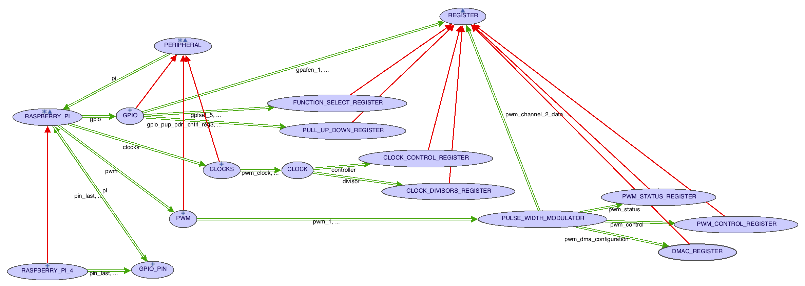

# jj_rPi 

## An Eiffel Library for controlling a Raspberry Pi

##Overview

This library allows a user to control a Raspberry Pi using Eiffel.  (Include [jj_rpi.ecf](./jj_rpi.ecf) in a project.)  The library is written entirely in Eiffel, with a few in-line C routines to interface with the hardware.

The library is divided into three parts:  1) the [interface](./interface), the [implementation](./implementation), and [devices](./devices).  The interface provides high-level access to the Pi's GPIO, CLOCKS, and PWM peripherals.  The implementation is lower-level code that interacts directly with the Pi's registers.  The devices directory contains a sample of devices (LED, BUTTON, and MOTOR) that can be controlled by a Pi.

## The Big Picture



##Example (high-level)

The system [rpi_demo.ecf](./demo/rpi_demo.ecf) uses [DEMO](./demo/demo.e) to show how to use some of the library's classes and features.  First notice that class [DEMO](./demo/demo.e) inherits from class [SHARED](./interface/shared.e), which provides access through feature *pi* to the one and only one [PI_CONTROLLER](./interface/pi_controller.e) in a system.  (At this time, the library supports only a [PI\_4\_CONTROLLER](./interface/pi_4_controller.e) but other controllers could be added.)  Class [PI_CONTROLLER](./interface/pi_controller.e) gives access to the Pi's [GPIO](./interface/peripherals/gpio.e), [CLOCKS](./interface/peripherals/clocks.e), and [PWM](./interface/peripherals/pwm.e) peripherals and to each [GPIO_PIN](./interface/gpio_pin.e).

Feature *chap\_1\_led* from class [DEMO](./demo/demo.e) illustrates some high-level features of the libary and gives a starting point to drill down into low-level implementation details.

```
	chap_1_led (a_count: INTEGER)
			-- Blink the led `a_count' times
		local
			i: INTEGER_32
			led: LED
		do
			print ("Blink an LED %N")
			pi.pin_18.set_mode ({GPIO_PIN_CONSTANTS}.Output)
			create led.connect (pi.pin_18)
			from i := 1
			until i > a_count
			loop
				led.turn_on
				print ("LED should be ON %N")
				sleep
				sleep
				led.turn_off
				print ("LED should be OFF %N")
				sleep
				i := i + 1
			end
		end
```
This feature uses the output from pin number 18 to blink an [LED](./devices/led.e) *a_count* number of times.  Notice that *pin_18* from the *pi* is first set to *Output* mode in order to satisfy the precondition to the [LED](./devices/led.e) creation feature *connect*.  Inside the loop, the code calls features *turn_on* and *turn_off* from class [LED](./devices/led.e).

##Example (drilling down)
Feature *turn_on* from class [LED](./devices/led.e) is a one-liner.

```
	turn_on
			-- Turn the led on
		do
			pin.set_state ({GPIO_PIN_CONSTANTS}.high)
		ensure
			is_on: is_on
		end
```
The call to *set_state* on object *pin* leads to class [GPIO_PIN](./interface/gpio_pin.e), which, disregarding the pre- and post-conditions, is also a one-liner.

```
	set_state (a_signal: NATURAL_32)
			-- Set `state' to `a_signal' (high or low).
			-- (i.e. send a one or zero.)
		require
			is_output_mode: mode = {GPIO_PIN_CONSTANTS}.output
			valid_signal: a_signal = {GPIO_PIN_CONSTANTS}.Low or a_signal = {GPIO_PIN_CONSTANTS}.High
		do
			pi.gpio.write_signal_on_pin (number, a_signal)
		ensure
			state_was_set: state = a_signal
		end
```
This call feature *write_signal_on_pin* from class [GPIO](./interface/peripherals/gpio.e).

```
	write_signal_on_pin (a_number: INTEGER_32; a_signal: NATURAL_32)
			-- Send `a_signal' (high or low) to `a_number'.
			-- (i.e. send a one or zero to that pin.)
		require
			valid_pin_number: is_valid_pin_number (a_number)
			is_output_mode: mode_on_pin (a_number) = {GPIO_PIN_CONSTANTS}.output
			valid_signal: a_signal = {GPIO_PIN_CONSTANTS}.Low or a_signal = {GPIO_PIN_CONSTANTS}.High
		local
			reg: REGISTER
		do
			if a_signal = {GPIO_PIN_CONSTANTS}.Low then
					-- Get the GPCLRx register associated with `a_number'
				reg := gpclr_register (a_number)
			else
					-- Get the GPSETx register associated with `a_number'
				reg := gpset_register (a_number)
			end
			reg.set_bit (a_number \\ 32)
		end
```
The feature simply sets a pin's output to either high or low.  It accomplishes this by writing a one to the appropriate bit of a particular register.  To make a pin output High the feature writes a one to one of the two GPCLRn (GPIO Pin Output Set Registers); to clear a pin (i.e. make it go low or to zero volts) the feature writes a ONE to one of the two GPCLRn (GPIO Pin Output Clear Registers).  Information about these registers are in [Broadcom BCM2835 ARM Peripherals](./docs/BCM2835 ARM Peripherals.pdf).

##Example (low-level)
The last line of the code above *reg.set_bit (a_number \\ 32)* brings the example down to the low-level implementation details.  Feature *reg* is of type [REGISTER](./implementation/registers), a class that uses in-line C code to write directly to memeory locations.  Here is feature *set_bit*, which changes a single bit in a 32 bit memory location while leaving the other bits unchanged.

```
	set_bit (a_index: INTEGER_32)
			-- Make the bit at `a_index' one without changing other bits
		require
			is_writable: is_writable
			is_bit_writable: is_bit_writable (a_index)
			valid_index: a_index >= 0 and a_index < 32
		local
			v: NATURAL_32
		do
			v := c_register_value (pointer)
			v := v.bit_or (pin_mask (a_index))
			c_set_register_value (pointer, v)
		end
```
And here is the referenced C code.

```
	c_register_value (a_address: POINTER): NATURAL_32
			-- The value stored at physical address `a_address'.
		external
			"C inline"
		alias
			"[
				unsigned int* v = (void*)($a_address);
				return (EIF_NATURAL_32) (*v);
			]"
		end

	c_set_register_value (a_address: POINTER; a_value: NATURAL_32)
			-- Set the value referenced by `a_address' to `a_value'
		external
			"C inline"
		alias
			"[
				unsigned int* a = ($a_address);
				*a = $a_value;
			]"
		end
```
This drill-down into the details shows how this library hides many details that a Raspberry Pi user need not know, but at the same time, allows the user to see the implementation if desired.  The main take-away is that the library user does not have to use bit-manipulation tricks seen in some python or C tutorials.

One detail in the above code was avoided until now.  From where does the *pointer* passed as argument in *a_address: POINTER* to the two feature of the above C code originate? 

##Back to the Top
The value of *pointer*, a feature of class [REGISTER](./implementation/registers), is assigned during creation from a *base_address + an_offset*.  The following code shows the creation calls for some of the registers of the [GPIO](./interface/peripherals/gpio.e) [PERIPHERAL](./interface/peripherals/peripheral.e), including creation of the GPSETn and GPCLRn registers discussed above.

```
	make (a_file_descriptor: INTEGER_32; a_length: INTEGER_32; a_address: NATURAL_32)
			-- Initialize Current
		do
				-- Precursor sets the `base_address'
			Precursor {PERIPHERAL} (a_file_descriptor, a_length, a_address)
				-- GPFSELx registers
			create gpfsel_0.make (base_address + 0x00, "GPFSEL0")
			create gpfsel_1.make (base_address + 0x04, "GPFSEL1")
			create gpfsel_2.make (base_address + 0x08, "GPFSEL2")
			create gpfsel_3.make (base_address + 0x0C, "GPFSEL3")
			create gpfsel_4.make (base_address + 0x10, "GPFSEL4")
			create gpfsel_5.make (base_address + 0x14, "GPFSEL5")
				-- reserved  0x18
			create gpset_0.make (base_address + 0x1C, "GPSET0")
			create gpset_1.make (base_address + 0x20, "GPSET1")
				-- reserved  0x24
			create gpclr_0.make (base_address + 0x28, "GPCLR0")
			create gpclr_1.make (base_address + 0x2C, "GPCLR1")
```
The offsets are giveing in [Broadcom BCM2835 ARM Peripherals](./docs/BCM2835 ARM Peripherals.pdf) and the base address is calculated by a call
>*base\_address := c\_mmap (a\_file\_descriptor, a\_length, a\_address)*

from class [PERIPHERAL](./interface/peripherals/peripheral.e).  The addresses ultimately come from feature *create\_interface\_objects* of class [PI_CONTROLLER](./interface/pi_controller.e) which attempts to open file "dev/mem" or file "/dev/gpiomen" and constants from class [PI\_4\_CONTROLLER](./interface/pi_4_controller.e).

```
feature {NONE} -- Implementation

	peripheral_base_address: NATURAL_32 = 0xFE000000
			-- Physical address of the first peripheral register
			-- Specific for this model.
			-- Not sure where this number originates, but it is in WiringPi
			-- and other software, and it seems to work.

	gpio_offset: NATURAL_32 = 0x00200000
			-- Offset from `peripheral_base_address' to GPIO registers.
			-- BCM2711 ARM Peripherals, page

	gpio_clocks_offset: NATURAL_32 = 0x00101000
			-- Offset from `peripheral_base_address' to GPIO clock registers.
			-- BCM2711 ARM Peripherals, page

	pwm_offset: NATURAL_32 = 0x0020C000
			-- Offsett from `peripheral_ase_address' to the PWM registers.
			-- BCM2711 ARM Peripherals, page
```
Again, these values are from the [Broadcom BCM2835 ARM Peripherals](./docs/BCM2835 ARM Peripherals.pdf) document.

